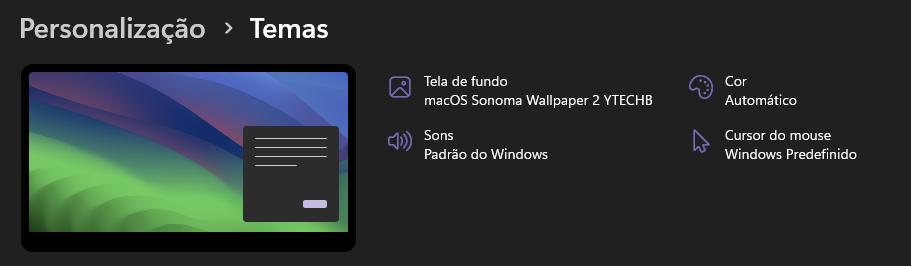

<h1 align="center"> 🎨 MacOs Sonoma Theme para o Windows 11 😄</h1>

    

 <a href="#status">Status</a> • 
 <a href="#objective">Objetivo</a> •
 <a href="#installation">Instalação</a> • 
 <a href="#technology">Tecnologias</a> • 
 <a href="#author">Autor</a> • 
 <a href="#licence">Licença</a>

<h2 align="center" id=status> 
	⌛ Concluído ⌛
</h2>

<h2 id=objective>📜 Sobre</h2>
Tema do Mac Os Sonoma para o Windows 11 

Tema incluso:

- Mac Os Sonoma

<h2 id=installation>✔️ Instalação</h2>

1. Clone o repo.
2. Va até a pasta "theme"
3. Dê dois cliques no thema desejado

<h2 id=technology>🧰 Tecnologias</h2>

As seguintes tecnologias foram utilizadas neste projeto:

- IDE: <a href="https://code.visualstudio.com/download">Visual Studio Code</a>
- Image manipulator: <a href="https://www.gimp.org/downloads/">Gimp</a>

<h2 id=author>😎 Autor</h2>

Developed by <a href="https://www.linkedin.com/in/danhpaiva/" target="_blank">Daniel Paiva</a>

<h2 id=licence>🆓 Licença</h2>
O projeto atual está sob a licença
<a href="https://github.com/danhpaiva/w11-theme-gnome44/blob/main/LICENSE" target="_blank">MIT</a>
